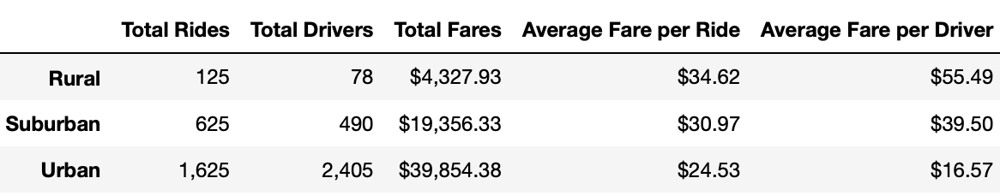
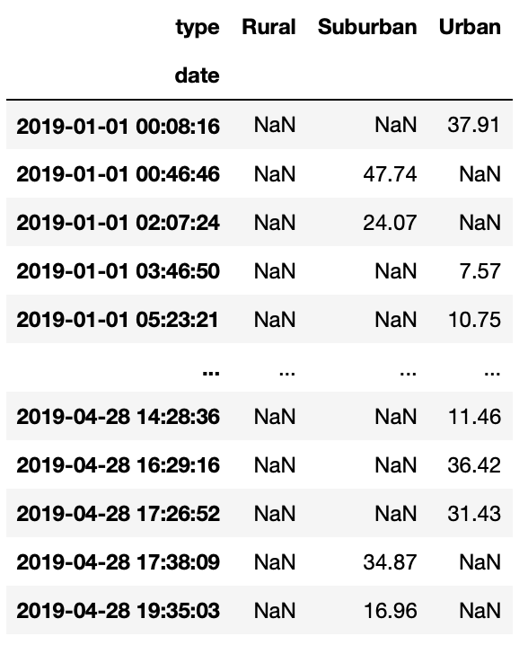
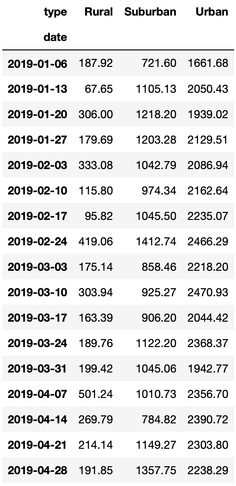
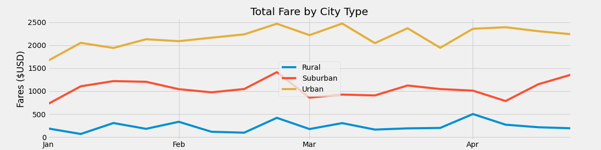

# PyBer_Analysis
# Overview of the analysis:
The purpose of Pyber Challenge 5 is to thoroughly analyze the data in csv files - titled [city_data.csv](Resources/city_data.csv) and [ride_data.csv](Resources/ride_data.csv) - and with the results create a line chart to present our findings. At the end of the analysis the goal was to create a DataFrame showing the total amount of money yielded from fares per each week, over a certain range of dates, in each city type. This DataFrame would then be used to create a line chart.  

Creating a visualization of this data allows us to easily see how the three different city types differ in terms of profitability and how this changes over time. From the analysis and line chart the viewer is able to identify which city type yields the most money in fares, sees the largest amount of rides and drivers, and which weeks are the most profitable. 

# Results:

## PyBer Summary DataFrame 

### Total Rides
By using the .groupby() function on ’type’ and .count() on ‘ride_id’ I was able to cumulate how many PyBer rides occurred in each city type. The results show that 125 rides took place in rural cities, 625 rides in suburban cities, and 1,625 rides in urban cities.

  > total_rides_per_city = pyber_data_df.groupby(['type']).count()['ride_id']
   
### Total Drivers
In a similar fashion to finding the total rides per city type, I used the .groupby() function on ’type’ and .sum() on ‘driver_count’ to find the total drivers providing service in each city type. The results show that 78 drivers were active in rural cities, 490 drivers were active in suburban cities, and 2,405 drivers were active in urban cities.

  > total_drivers_per_city= city_data_df.groupby(['type']).sum()['driver_count']

### Total Fares 
Next, I reworked the code used to find the total drivers per city type to find the total fares per city type. To accomplish this I used the .groupby() function on ’type’ and .sum() on ‘fares.’The results show that $4,327.93 was gained in rural cities, $19,356.33 was gained in suburban cities, and $39,854.38 was gained in urban cities.

  > total_fares_per_city= pyber_data_df.groupby(['type']).sum()['fare']

### Average Fare per Ride 
In two separate cells I calculated the average fare per ride and average fare per driver. 
First, I divided the total fares per city by the total rides per city. From this the results show that on average one ride cost $34.62 in rural cities, $30.97 in suburban cities, and $24.53 in urban cities. 

  > avg_fare_per_city = total_fares_per_city/ total_rides_per_city

### Average Fare per Driver
In the second cell I divided the total fares per city by the total drivers per city. From this I found that on average one driver correlates to $55.49 in rural cities, $39.50 in suburban cities, and $16.57 in urban cities. 

  > avg_fare_driver_per_city = total_fares_per_city/total_drivers_per_city

### PyBer Summary Dataframe
Lastly, after analyzing the data and gathering the necessary information I was able to create a dataframe pyber_summary_df. 

 

## Total Fare by City Type Line Plot 

### Pivot Table
For the second portion of this challenge we needed to create a new DataFrame showing the sum() of ‘fares’ for each date and city type. Using the groupby() function I was able to group city types and dates from the original merged DataFrame, and by using the sum() function I was able to add together all the fares received per each day.
This DataFrame, titled pyber_date_type_df, was utilized to create a pivot table having the date as the indices, the city types as columns, and the fares as the values. This pivot table is titled pyber_date_type_pivot. 

 

### Resampled DataFrame and Line Chart
The next step for this challenge was to create another DataFrame, splicing out information for dates within the range '2019-01-01':'2019-04-29' from the pyber_date_type_pivot DataFrame. This new DataFrame, titled pyber_2019, was then resampled to bin together datapoints within the same week. This resampled DataFrame was titled pyber_2019_resample and was used to create the final product, the line chart titles ‘Total Fare by City Type.'
pyber_2019_resample DataFrame:

 

Total Fare by City Type line chart:
 

# Summary:
My business recommendations for the CEO would depend on what their goals are for the company. From the data we can see that the average fare per driver and ride are the greatest in rural city types. Rural cities also have the least amount of rides and drivers. Conversely, the urban cities have the most rides and drivers, but the average fare per ride and driver are the least out of the 3 city types.

I also noticed that the amount of drivers in urban cities outnumbers the amount of rides, which contributes to the average fare per drivers being very low. Due to this, I would suggest that the company decreases the amount of drivers in urban cities.

Following my previous suggestion, I might suggest that some of the drivers stationed in urban cities be encouraged to drive in rural cities. This could bring some balance between the two city types, increasing the average fare per ride and driver in the urban cities.

Lastly, I would suggest that drivers are encouraged to work more during the weeks where more customers are requesting rides. Having weeks where the sum of all fares are higher than others suggests that the demand for rides are higher during those weeks, so I would encourage the drivers to be more active during those times.  
